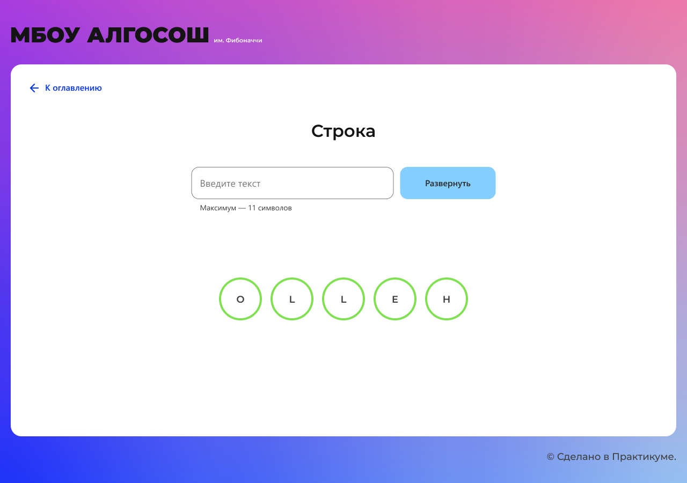
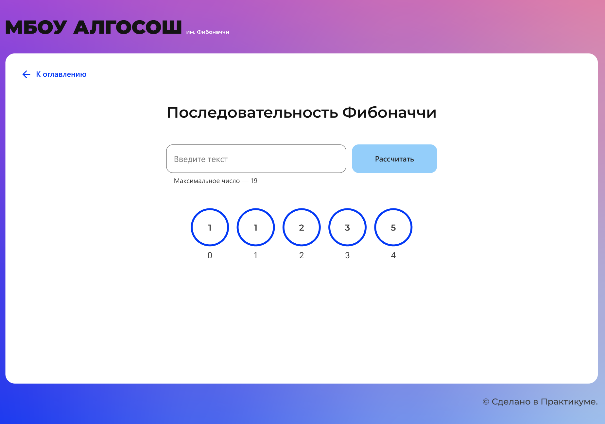
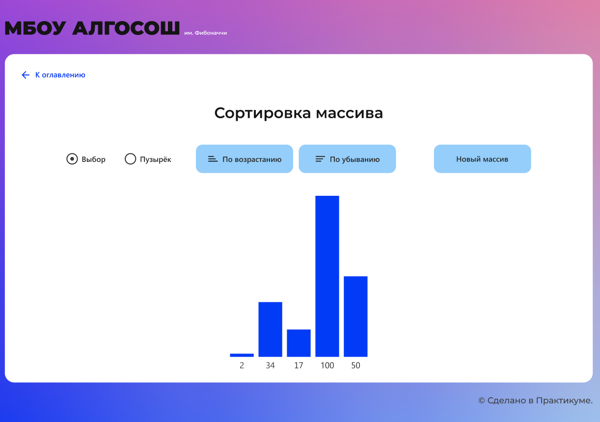
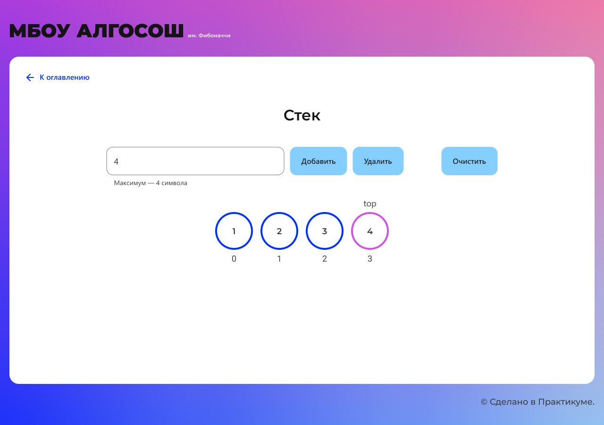
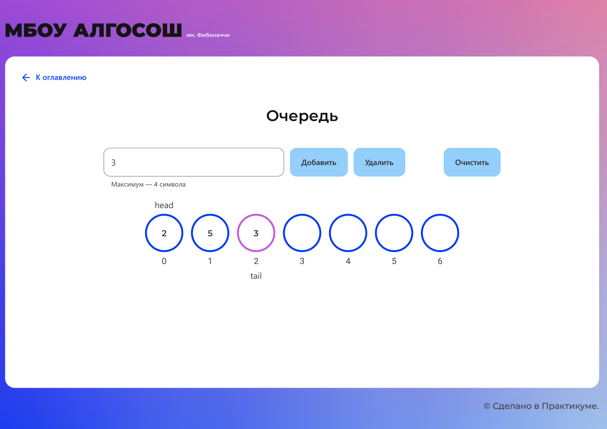
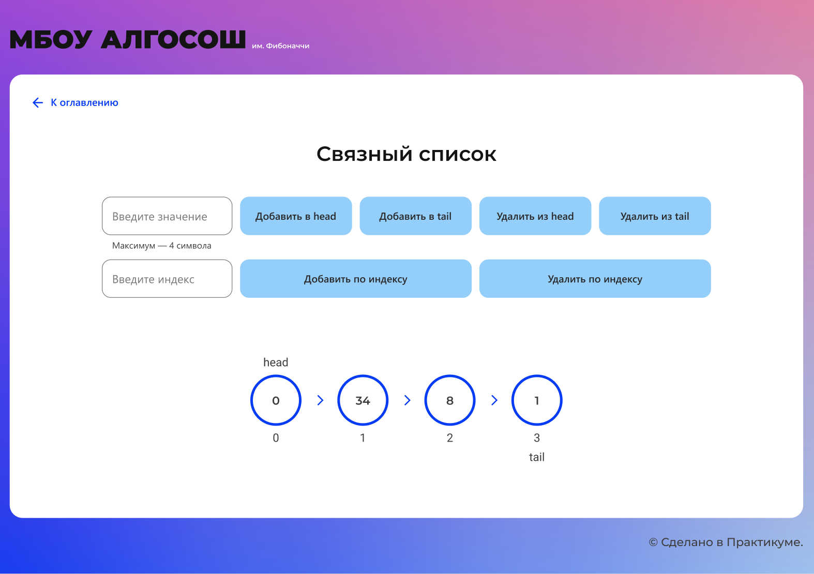

# Проектная работа. МБОУ АЛГОСОШ им. Фибоначчи

## Описание проекта

С макетом можно ознакомится по [ссылке.](https://www.figma.com/file/RIkypcTQN5d37g7RRTFid0/Algososh_external_link?node-id=0%3A1)

[Открыть проект.](https://ev-kos.github.io/algososh/)

В проекте реализована визуализация алгоритмов с использованием Unit-тестирования (Jest) и E2E тестирования (Cypress):

- #### Разворот строки


- #### Последовательность Фибоначчи


- #### Сортировка массива


- #### Стек


- #### Очередь


- #### Связный список


## Используемые технологии

&nbsp; 
&nbsp; 
&nbsp;
&nbsp;

## Запуск проекта

- Клонировать репозиторий ```git clone```
- Установить зависимости ```npm install```
- Собрать проект ```npm run build```
- Запустить проект ```npm start```


